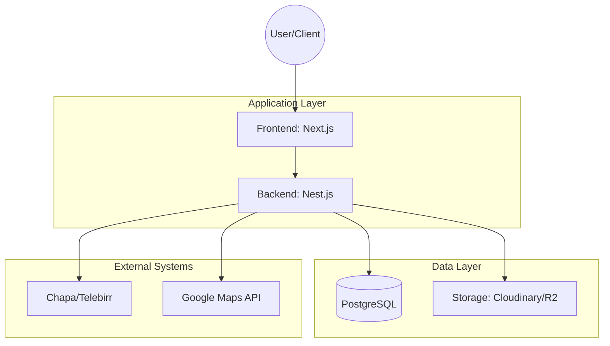

# Software Design Specification (SDS)
## Project: Arba Minch Tourism Platform ("VArb")
**Version:** 1.0

---

## 1. System Architecture
### 1.1 High-Level Architecture
The system follows a modern **Three-Tier Architecture** that evolves across development phases.



### 1.2 Phased Evolution Theory
- **Phase 1:** Frontend only. Next.js App Router serves static content from local JSON.
- **Phase 2:** Integration of Nest.js and Supabase (PostgreSQL). NextAuth handles session-based security.
- **Phase 3:** Extension of the backend logic for payments and complex PDF generation.

---

## 2. Database Design (Phase 2 & 3)
### 2.1 Entity Relationship Diagram (ERD) Conceptual Schema
- **User (1:1) Profile:** Every user has one profile (Tourist or Service Provider).
- **Profile (1:N) Listing:** A service provider can host multiple listings (Hotel, Guide, etc).
- **Listing (1:N) Review:** Each listing accumulates reviews from multiple tourists.

### 2.2 Table Definitions
#### `users`
| Column | Type | Constraints | Description |
| :--- | :--- | :--- | :--- |
| `id` | UUID | PK, Generated | Unique user identifier. |
| `email` | VARCHAR | Unique, Indexed | Login identifier. |
| `role` | ENUM | tourist, provider, admin | Controls access levels. |
| `created_at` | TIMESTAMP | DEFAULT NOW() | Audit trail. |

#### `listings`
| Column | Type | Constraints | Description |
| :--- | :--- | :--- | :--- |
| `id` | UUID | PK | Listing identifier. |
| `owner_id` | UUID | FK -> users.id | Reference to provider. |
| `title` | VARCHAR | NOT NULL | Name of the service. |
| `category` | VARCHAR | NOT NULL | Hotel, Restaurant, etc. |
| `avg_rating` | NUMERIC | DEFAULT 0 | Computed for performance. |
| `is_verified`| BOOLEAN | DEFAULT FALSE | Managed by Admin. |

---

## 3. API Specification
### 3.1 RESTful Patterns
All endpoints are prefixed with `/api/v1/`.

#### `GET /listings`
- **Query Params:** `category`, `sort` (price/rating), `limit`, `offset`.
- **Response:**
  ```json
  {
    "data": [ { "id": "uuid", "title": "Paradise Lodge", "rating": 4.8 } ],
    "pagination": { "total": 120, "page": 1 }
  }
  ```

#### `POST /payment/initialize` (Phase 3)
- **Payload:** `{ "listing_id": "uuid", "tier": "premium" }`
- **Logic:** Calls Chapa API, returns redirect URL.

---

## 4. Frontend Architecture
### 4.1 Component Strategy
- **Base UI:** Custom Tailwind components for buttons, inputs, and cards.
- **State Management:**
  - **Server State:** `React Query` or Next.js `fetch` with tags for caching.
  - **Client State:** `Zustand` for the Trip Planner bucket and UI themes.

### 4.2 SEO Strategy
- Dynamic `generateMetadata` for every attraction/listing.
- Structured Data (JSON-LD) for LodgingBusiness and TravelAgency types.

---

## 5. Sequence Diagram: Trip Planning (Phase 3)
```mermaid
sequence_diagram
    participant U as User
    participant F as Frontend (Zustand)
    participant B as Backend
    participant P as PDF Engine

    U->>F: Add "Nech Sar" to Bucket
    U->>F: Click "Download Itinerary"
    F->>B: Request Detailed Data for IDs
    B-->>F: Return Attractions + Contacts
    F->>P: Generate PDF Layout
    P-->>U: Deliver .pdf file
```

---

## 6. Security & Infrastructure
- **Authentication:** NextAuth.js with JWT Strategy.
- **Media:** Cloudinary for image transformations (auto-resize/webp).
- **Deployment:** Vercel for Frontend, Railway or AWS for Nest.js/Postgres.
